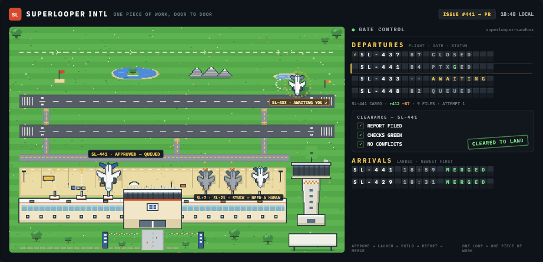
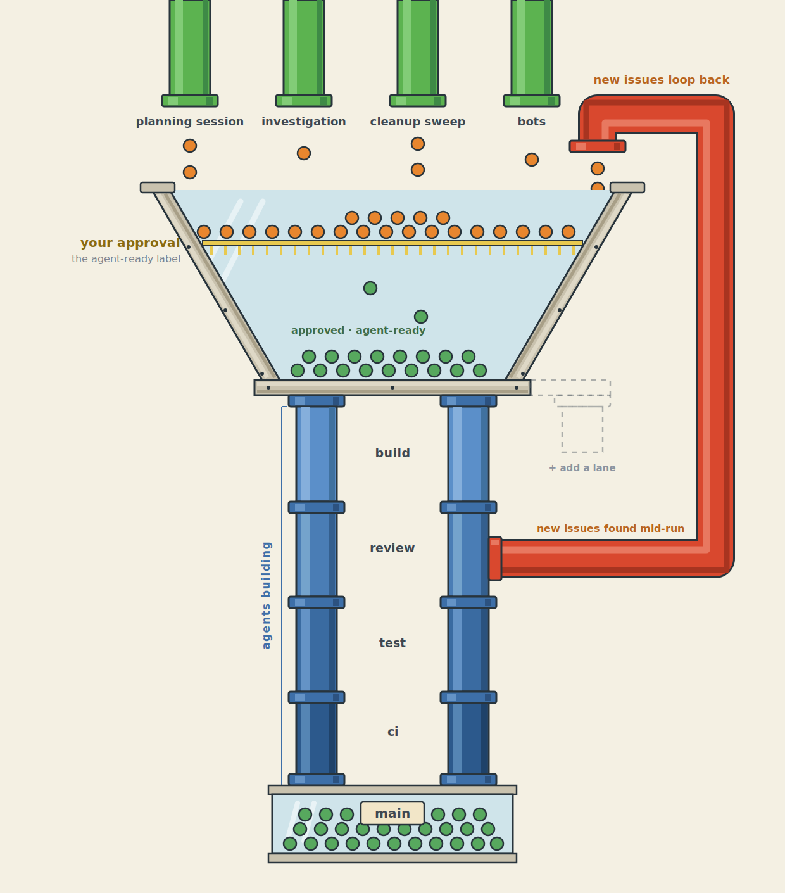
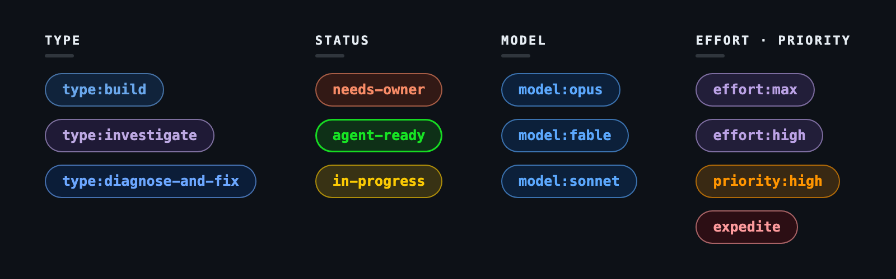
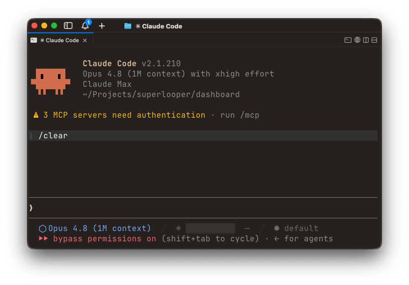
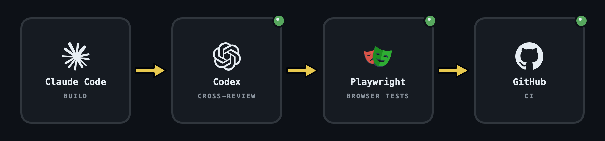
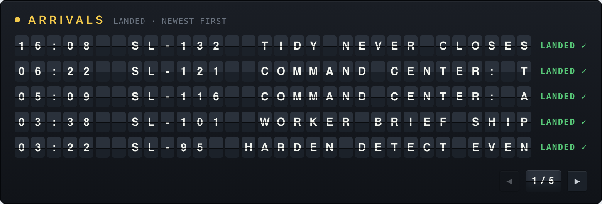
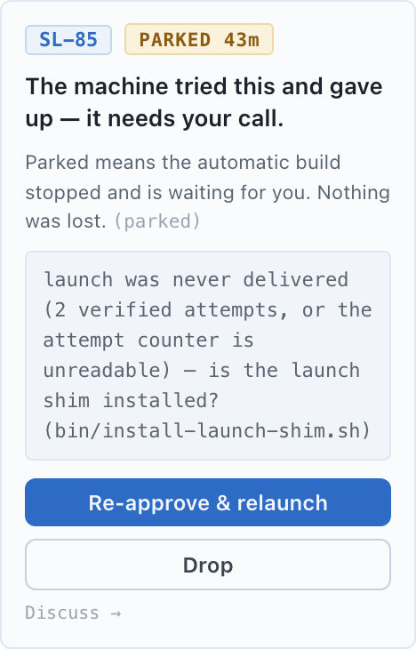

<div align="center">

# superlooper

**The vibe coding workflow that runs while you sleep.**



</div>

superlooper is an agentic harness that sits on top of Claude Code, designed to make your
coding workflow easier and more productive. It takes your input where it matters and runs
on its own everywhere else (no more copying and pasting). Plan the work on your time, and
leave it alone to build for hours on end.

## A night on the loop

You built the CRM your company runs on: pipeline, contacts, the follow-up cadence your
sales team lives by. Off-the-shelf never fit how you sell, so you made your own. It works,
the team depends on it, and your idea list grows faster than your evenings.

Tonight's idea is big: calling, built in. Click-to-call from any contact, recordings
attached to the deal, transcripts you can search. You sit down with Claude Code and talk
it through. It asks the questions you hadn't thought to answer (what happens to a
recording when a deal is deleted?) and proposes eight GitHub issues: one PR-sized chunk of
work each, in an order that builds. You read them, tighten two, and approve the lot: all
eight `agent-ready`. The telephony integration gets `model:opus` and `effort:max`. The
subjective one (figure out why the pipeline view is hard to scan) becomes a
`type:investigate` running `model:fable` at `effort:high`. The CSS tweak gets
`model:sonnet`. A rep also flagged a bug today: bulk import lands deals in the wrong
stage. That becomes a ninth issue, `priority:high`.

Then you start the runner (`superlooper run`) and go to bed.

Overnight, terminal windows open and close on your Mac. The import bug goes first. Each
issue gets a fresh Claude Code session in its own worktree, and each finished piece has to
prove itself before it ships. In a real browser, the agent clicks through the screens it
changed, and GPT (via Codex) picks over the code and sends back problems to fix. Then the
test suite runs clean in CI. Two issues touch the call-log schema, so the second holds
until the first lands. One build fails its own suite on the first try and lands on the
second. And one turns out to need a decision only you can make (keep call recordings
forever, or purge them after ninety days?), so it stops and writes you a memo instead of
guessing.

In the morning you read the arrivals board over coffee: seven landed on your dev branch,
one question waiting, and the investigation filed three small issues proposing
pipeline-view fixes. You answer the memo, approve two of the three, and get on with your
day. When the release is ready, promoting it to the CRM your team actually uses is a
single decision on a full report. `superlooper promote-report` gathers everything that
landed since the last release and reruns the nightly suite before you say go.

That's the shape of it: you show up for the decisions and nothing else.

<div align="center">

</div>

## How it works

Step by step:

1. Work becomes issues. Wherever the work comes from (a planning session with an agent, a
   follow-up filed by an investigation, a cleanup sweep, a bot), each piece of work is a
   GitHub issue, scoped small, carrying the context a fresh agent will need.

   

2. You approve and steer with labels. Saying yes puts the `agent-ready` label on an
   issue. That label is your word: no agent is allowed to apply it, ever. It's also your
   safety filter, so never approve an issue you haven't read. The rest of the label set is
   how you steer without writing code:

   

3. A terminal window opens. The runner starts a fresh Claude Code session for the issue in
   a new terminal tab on your Mac (via cmux, a tiling terminal), on your subscription. The
   session works in its own git worktree, an isolated copy of your repo. Fresh session
   means no leftover context from three tasks ago; a window on your machine means you can
   watch any build, any time, or ignore them all.

   

4. The work has to prove itself. The worker builds test-first: a failing test, then the
   code that passes it, then regression tests over what changed (the order is instructed;
   what the gate enforces is the evidence). Before shipping, it must drive the changed
   behavior end-to-end and record what it saw, in a real browser (Playwright) for a web UI
   or against the actual CLI or API surface otherwise. Then cross-review: the diff goes to a reviewer
   that wrote none of it (by default GPT via the Codex CLI, a different model family
   entirely) and its findings get fixed and re-reviewed. The verdict is posted on the pull
   request, where the merge gate requires it mechanically: no review verdict, no merge. CI
   runs your required checks on top. The gate that finally merges walks a literal
   checklist (report filed, review verdict present, checks green, branch mergeable). Code,
   not judgment, decides it. The floor is your test suite plus the reviewer; work that
   fools both can still land, which is why the loop refuses to run without real checks.

   

5. It lands, in order. The runner merges through your own `gh` login, under your repo's
   branch protections. If two lanes' work would overlap, the second holds until the first
   is in: number two for landing. And if the codebase moved underneath a finished piece so
   it no longer fits cleanly, the loop retires that attempt and rebuilds the issue fresh
   against the updated code rather than hand-patching the conflict. If the rebuild
   conflicts again, it's handed to you instead.

   

6. Or it comes back to you. A decision that needs an owner, a repeated failure, a change
   that exceeds the issue's boundaries: each comes back with a short memo instead of
   getting buried.

   

If you wire up the optional nightly test run, a browser suite drives your running dev site
overnight. Anything still broken on retry gets filed as a fix issue, and landings pause
until the dev branch is green again.

Two things to know before you run it unattended. Worker sessions run Claude Code with
permissions bypassed (a session that stops to ask at 3am would just hang), each confined
to its own worktree; that's an agent with a shell on your machine, so treat it accordingly.
And the runner watches your subscription's usage windows, pausing launches when they're
nearly spent and resuming when they reset.

## The dashboard

command-center is the loop's face: an animated 16-bit airport where each of your repos is
a terminal and every issue in flight is a plane flying its circuit. It exists so you can
keep track of everything in flight at a glance, and because watching your work land should
be fun.

The two boards carry the state you'll actually check. Departures is the queue: what's
approved and waiting, in real launch order. Arrivals is what's landed: merged work, newest
first, in plain sentences. Between them, the field shows every running session at its true
stage, from taxiing out (launching) through mid-circuit (building) to final approach. On
final, the clearance checklist fills in (report ✓ review ✓ CI ✓ mergeable ✓, the literal
merge gate). Every stage of a flight is a real state of the work rather than decoration.

There is no AI anywhere inside the dashboard, and its server binds to localhost only. It
can write labels on your repos, so it is never reachable off your machine. It's a separate
clone-and-run app: Python stdlib, no build step, no dependencies. Setup lives in
[dashboard/README.md](dashboard/README.md).

## What you get

Five skills, installed as a Claude Code plugin. Pure markdown, nothing executable; a CI
test keeps it that way:

| Skill | The job |
|---|---|
| `/superlooper:adopt` | walks a repo into the loop, end to end |
| `/superlooper:write-issue` | turns a planning conversation into loop-ready issues: small, self-contained, carrying every label except the one that's yours |
| `/superlooper:superlooper` | the workflow itself: approvals, runner operations, the morning report |
| `/superlooper:cross-review` | a second-opinion review from a different model family, or from a fresh subagent that wrote none of the code |
| `/superlooper:sl-debugger` | diagnoses the loop itself when something looks off |

One CLI, installed through the gated installer. The main verbs:

```
superlooper adopt      # wire a repo into the loop
superlooper doctor     # check everything, name every fix
superlooper run        # start the loop
superlooper janitor    # propose cleanup; execute only what you approve
superlooper tidy       # close the terminal windows of finished sessions
superlooper watchdog   # optional: texts you if the loop wedges, then sends a repair session
```

And the dashboard, a separate clone-and-run app. The airport.

## Requirements

The hard ones:

- A Mac. The loop runs on your machine, in real terminal tabs, with real notifications.
- Claude Code, signed into your subscription. That's the agent that builds. Codex (a newer
  addition) works too, and the best setup is both: Claude Code builds, Codex gives the
  second-opinion review. Codex is optional, though; without it, the review comes from a
  fresh agent that wrote none of the code.
- A GitHub repo you own, with a test suite. The loop refuses to merge anything without at
  least one required CI check. No tests, no gate, no loop. (No tests yet? Ask Claude Code
  for a starter suite before you adopt; `doctor` will tell you when the wiring is right.)

Everything else (cmux, `gh`, `jq`) installs in minutes, and the doctor walks you to green.

## Install

The short version: paste this repo's URL into a Claude Code session and say "install
this", and the `adopt` skill walks the agent through everything below. The long version:

**1. Add the plugin.** Skills only; markdown lands, nothing executes:

```
claude plugin marketplace add willprout/superlooper
claude plugin install superlooper@superlooper
```

**2. Install the engine.** This is the one gated step. The runner, the CLI, and the hooks
are real code, so they arrive through a different door: a clone you control, and an
installer that shows you exactly what it's about to put on your machine, then asks.

```
git clone https://github.com/willprout/superlooper
cd superlooper
./bin/install.sh
```

Re-run it after pulling updates: it shows the diff since your last install and asks again.
That's deliberate. Nothing executable ever reaches your machine without you seeing it and
saying yes.

**3. Let the doctor find what's missing.**

```
superlooper doctor --stack
```

It names every missing machine block with its exact fix: cmux (the terminal the loop opens
its sessions in), `gh` login, a notification channel. Safe to re-run until everything is
green.

**4. Adopt a repo and run.**

```
superlooper adopt  --repo /path/to/your/repo
superlooper doctor --repo /path/to/your/repo
superlooper run    --repo /path/to/your/repo
```

`adopt` writes the config and creates the labels; `doctor` checks the wiring; `run` starts
the loop in a terminal tab you can watch. Approve an issue and watch it take off. No
issues yet? Open a planning chat and run `/superlooper:write-issue`; approving means
adding the `agent-ready` label to the issue.

## Customization

Every adopted repo carries its own contract: `.superlooper/config.json`, written by
`adopt` and read by everything else. There are no global settings; each repo decides how
much rigor it wants:

- `lanes`: how many issues build at once. A plain `2` for throughput;
  `{"build": 1, "investigate": 1}` keeps merge-producing work strictly sequential while
  investigations still run alongside.
- `areas` and `affinity`: what "touching the same thing" means. Map path globs to named
  areas, and two issues run together only when their declared areas don't overlap.
- `required_checks`: the CI checks that must be green before a merge. At least one is
  mandatory; the loop refuses to run a repo with no mechanical gate.
- `ship_cmd`: hand shipping to your own pipeline. When set, workers ship exclusively
  through it and your pipeline owns review; when unset, the loop's gate requires the
  fresh-agent review verdict on every PR.
- `models.worker` and `models.worker_effort`: repo-wide defaults for worker model and
  effort. Per-issue `model:` / `effort:` labels override them.
- `report_required_sections`: the evidence every worker report must contain. The default
  asks only for what any repo can show (Tests, Review); a web repo adds a browser-evidence
  section and the gate enforces it like the rest.
- `bright_lines`: prose rules injected verbatim into every worker brief, like "never touch
  migrations" or "ship only via ship.sh".

The point of per-repo contracts: your internal admin tool can run loose (two lanes,
default review, maximum velocity) while your production repo runs tight. Tight means one
sequential build lane, shipping only through its own review-and-CI pipeline, browser
evidence in every report, and bright lines around the code that moves money. Same loop,
different contracts. Every field is documented in
[ADOPTING.md](skills/superlooper/skill/docs/ADOPTING.md).

## What it deliberately refuses to do

- It never approves its own work. `agent-ready` is a human word. No agent applies it, no
  code applies it, and the loop treats an issue without it as invisible.
- It never merges red. Tests, review, CI, mergeable: all green, or the work waits and the
  reason comes back to you.
- Nothing executable rides an update. Plugin updates carry markdown only. Engine changes
  sit inert on main until you re-run the gated installer and OK the diff; a bad merge
  cannot reach your machine on its own.
- No AI inside the dashboard. It's a renderer over GitHub and the loop's own journal.
  Localhost only.
- It never nags. The loop pushes a notification for the handful of things that stop work
  outright, plus one morning report, and otherwise waits for you to look.

## Going deeper

- [ADOPTING.md](skills/superlooper/skill/docs/ADOPTING.md): the full adoption contract
  (every config field, the label set, branch protection).
- [STACK.md](skills/superlooper/docs/STACK.md): the machine stack, block by block.
- [dashboard/README.md](dashboard/README.md): installing and running the airport.
- [The design records](skills/superlooper/docs/): how it all got decided, including the
  [dashboard's own design record](dashboard/docs/DESIGN-RECORD.md).

## Acknowledgements

**Ideas borrowed:** the load-bearing ones, with thanks.

- **The label-gated issue conveyor**, from [Cat Wu](https://www.theneuron.ai/explainer-articles/claude-code-creators-boris-cherny-and-cat-wu-explain-how-to-use-agent-loops/).
  Her routine at Anthropic listens to a ticket queue and turns tickets into fix PRs:
  issues in, a human-controlled trigger, reviewed changes out. That conveyor is the spine
  of superlooper; everything else here is armor bolted onto it.
- **Make the agent run the thing; every mistake becomes a rule**, from [Boris Cherny](https://howborisusesclaudecode.com).
  Two of his habits became mechanisms: no work ships until the agent has driven what it
  changed for real, and every failure gets written into a standing rule so it can't
  happen twice.
- **Loop engineering**, from [Addy Osmani](https://addyosmani.com/blog/loop-engineering/).
  He named the discipline and mapped its parts. State on disk, worktrees for isolation,
  and verifiers that aren't the builder are all applied here as he described them.
- **Loose gates, strong verification**, from [Peter Steinberger](https://newsletter.pragmaticengineer.com/p/the-creator-of-clawd-i-ship-code).
  His published numbers showed that throughput comes from strong verification behind
  loose merge gates, not from clever orchestration. That finding deleted an entire
  orchestrator from an earlier version of this design.

**Novel here**, as far as I could find: the regenerate-don't-resolve rule (conflicted
work is rebuilt fresh, never hand-patched) and the thin-issue doctrine. The particular
combination (nightly QA that files its own issues, a human approval label, fresh-session
builds, a mechanical merge gate, batched promotion) doesn't seem to have been published
as one system before either. The research trail is in the
[founding spec](skills/superlooper/docs/founding/SPEC-2026-07-02-issue-loop-workflow.md).

**Special thanks** to [Geoffrey Huntley](https://ghuntley.com/ralph/),
[Dex Horthy](https://www.humanlayer.dev/blog/brief-history-of-ralph),
[Rich Snapp](https://www.richsnapp.com/article/2026/03-30-automating-your-agents),
[Avasdream](https://avasdream.com/blog/github-agent-loop-automation-humanized), and
[GitHub Next](https://githubnext.com/projects/agentic-workflows/).
